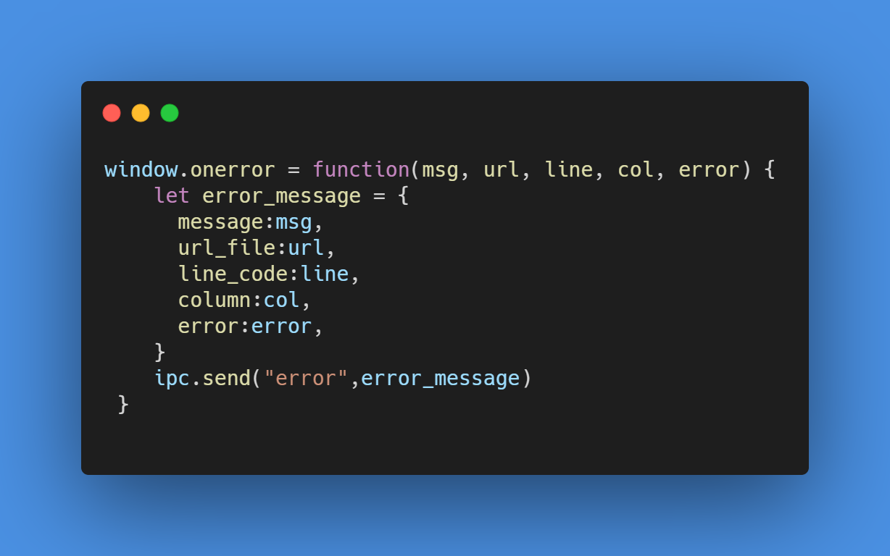

# ElectronJs Crash And Error Catching


In Electronjs You Need A Crash Report Methods To Debug Your Application And Cath Errors 
And Crashes 

So Read This Tips :  

### 1-  Using The Electron Crash Reporter Tool 

Documentation For Electron Crash Reporter  : [Electron | crashReporter ](https://www.electronjs.org/docs/latest/api/crash-reporter)
- crashReporter doesn't catch renderer process crashes no matter where you start it (main or renderer process

### 2-   Using Some Codes In The Rendere Process 
   #### - Using Window Event Like The [window.onerror ](https://developer.mozilla.org/en-US/docs/Web/API/GlobalEventHandlers/onerror#window.onerror) 
- Render Process : 
```
window.onerror  =  function(msg, url, line, col, error) {
		let error_message = {
			message:msg,
			url_file:url,
			line_code:line,
			column:col,	
			error:error,
		}
		//send The Error To Main Process 
		ipc.send("error",error_message)
		}
```
- Main Process : 
```
ipc.on("error",(event,error)=>{
	console.log(error);
})
```
  
### 2- The Main Process :
-  render-process-gone Event [Web Contents Event ](https://www.electronjs.org/docs/latest/api/web-contents#event-crashed-deprecated) : 

```
mainWindow.webContents.on('render-process-gone',(event ,details )=>{
	console.log(details);
})
```




   
